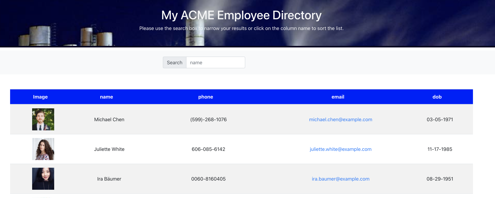

# Employee Directory in React

## Live Version (Githubpages)
https://josesanchezcapo.github.io/employee-directory/

##

## Overview
    The directory is created with react. The UI into components, mange component state and respond to
    users events.

## User Story
    * The user, wnat to be able to view entire employee directory.
        * Sort the table by category
        * Filter employee by Name

## Data Source
https://randomuser.me

## Contact Information

    email: josesanchezcapo@gmail.com

## License Type
    *GNU GENERAL PUBLIC LICENSE

